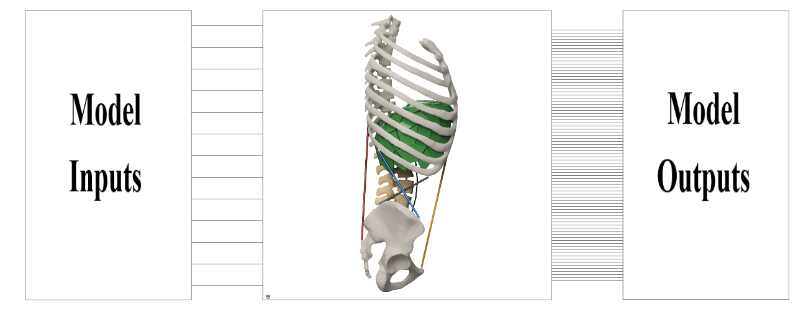

# RBDmodel-io
Repository containing the Rigid Body Dynamic MATLAB model of the spine, referenced in Dukkipati & Driscoll 2025

S. T. Dukkipati and M. Driscoll, "Evaluation of a Fast-Solving Rigid Body Spine Model Inclusive of Intra-Abdominal Pressure," in IEEE Transactions on Biomedical Engineering, doi: [10.1109/TBME.2025.3561692](http://doi.org/10.1109/tbme.2025.3561692). 

## Project Overview
This repository provides a MATLAB/Simulink implementation of a rigid body dynamic (RBD) model of the human spine, including intra-abdominal pressure (IAP) effects. The model is designed for fast simulation and benchmarking, and is referenced in the above publication.

### Main Files
- `RBDmodel_io.slx` / `main_model.slxp`: Simulink models of the spine.
- `benchmarking.m`: MATLAB script to benchmark model compile and run times.
- `README.md`: Project documentation.
- `CITATION.cff`: Citation information.
- `LICENSE`: MIT License.

## Simulink Model Structure
The Simulink model (`RBDmodel_io.slx` or `main_model.slxp`) consists of:
- **Model Workspace**: Contains all tunable parameters. Parameters ending with `_FIXED` are not user-editable.
- **Inputs**: Muscle forces, moments, and intra-abdominal pressure (see table below).
- **Model_Outputs Subsystem**: All outputs are available here. Use Simulink scopes or "To Workspace" blocks to view/export results.

### Model Inputs
| Parameter          | Description                                              |
|--------------------|----------------------------------------------------------|
| IAP_Pa             | Intra-abdominal pressure in Pascals, used in IAP Model 1 |
| Left_RA/Right_RA   | Left and right rectus abdominus muscle force in Newtons  |
| Left_MF/Right_MF   | Left and right rectus multifidus force in Newtons        |
| Left_IO/Right_IO   | Left and right internal oblique muscle force in Newtons  |
| Left_EO/Right_EO   | Left and right external oblique force in Newtons         |
| Moment_FE          | Flexion-Extension Moment at L1 in Nm                     |
| Moment_LB          | Lateral bending Moment at L1 in Nm                       |
| Moment_AR          | Axial rotation Moment at L1 in Nm                        |

### Model Outputs
- All outputs are available in the `Model_Outputs` subsystem.
- To view outputs, open the corresponding Simulink scope or use "To Workspace" blocks to export data.

## Running the Model
1. Open MATLAB and navigate to the `RBDmodel-io` directory.
2. Open the Simulink model (`RBDmodel_io.slx` or `main_model.slxp`).
3. Adjust input parameters in the Model Workspace as needed.
4. Run the simulation.
5. View outputs in the `Model_Outputs` subsystem.

## Benchmarking Script
The `benchmarking.m` script benchmarks the model's compile and run times:
- Edit `numRuns` to set the number of repetitions.
- Run the script in MATLAB. It will print average and standard deviation for compile and run times.

## Windows/MATLAB Notes
- This project is tested on Windows with MATLAB and Simulink.
- Some files (`.mexw64`, `.slxc`, `.slxp`) are platform-specific or binary.
- For editable model files, contact the authors.

## Citation
If you use this software, please cite:
S. T. Dukkipati and M. Driscoll, "Evaluation of a Fast-Solving Rigid Body Spine Model Inclusive of Intra-Abdominal Pressure," IEEE Transactions on Biomedical Engineering, 2025. [DOI](http://doi.org/10.1109/TBME.2025.3561692)

## License
This project is licensed under the MIT License. See `LICENSE` for details.

## Contact
For questions or editable model files, contact the authors:
- Siril Dukkipati: siril.dukkipati@mail.mcgill.ca
- Mark Driscoll: mark.driscoll@mcgill.ca
